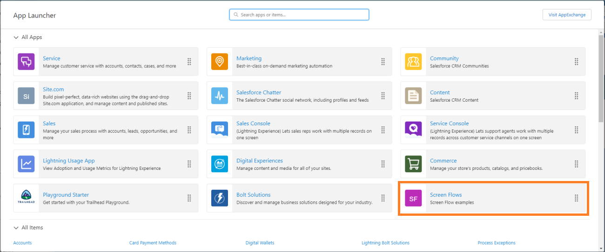
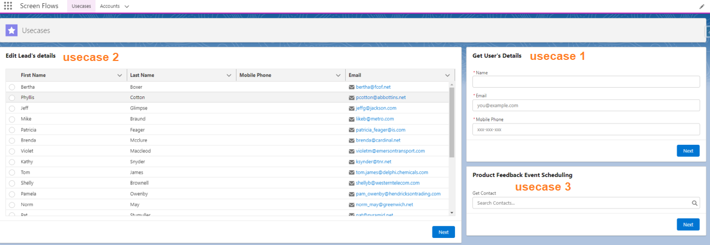
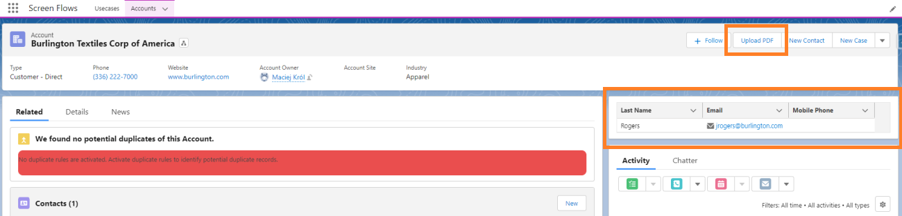

# SCREEN FLOWS

Repository with supporting materials for workshops on Screen Flows.

## CLONE REPOSITORY 

* Open Windows Command Prompt
  * Press [WIN]+[R], type `cmd`, press [Enter] 
* type `git clone https://github.com/maciejkrolpl/screen-flow.git`

## AUTHORIZE AN ORG

* type `sf org login web -s -a <org-alias> -r <instance-url>`
  * org-alias is an alias you're free to specify
  * instance-url is an url you are logging in from, you can omit it if you're authorizing Playground Org
* browser opens, log in to your org and click **Allow**

## DEPLOY METADATA

* type `sf project deploy start  --source-dir force-app`

## ASSIGN PERMISSION SET

* type `sf org assign permset -n scfl_LightningApp`

## OPEN ORG

* type `sf org open`

## LAUNCH AN APP

Additional flows using `{recordId}`

