# TUTORIAL

### Czyli instrukcja jak rozwiązać najłatwiejszy use-case.

---

## Stwórz Screen flow

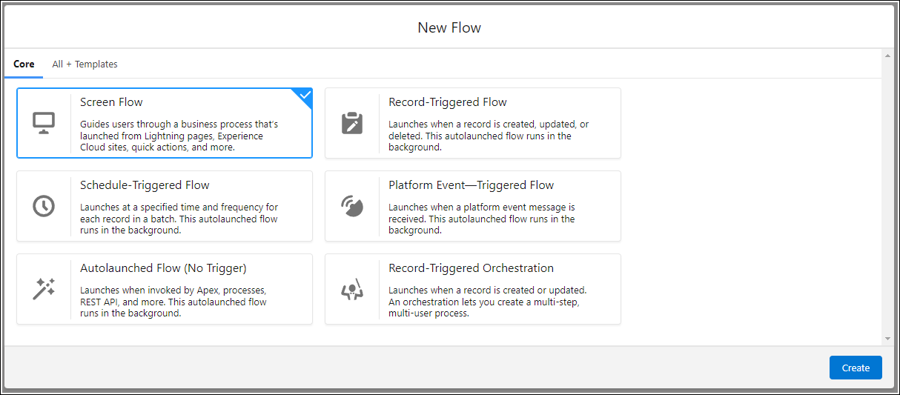

## Dodaj element typu Screen

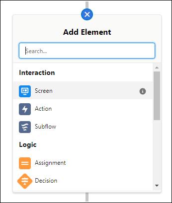

## Wypełnij pola Label i API Name

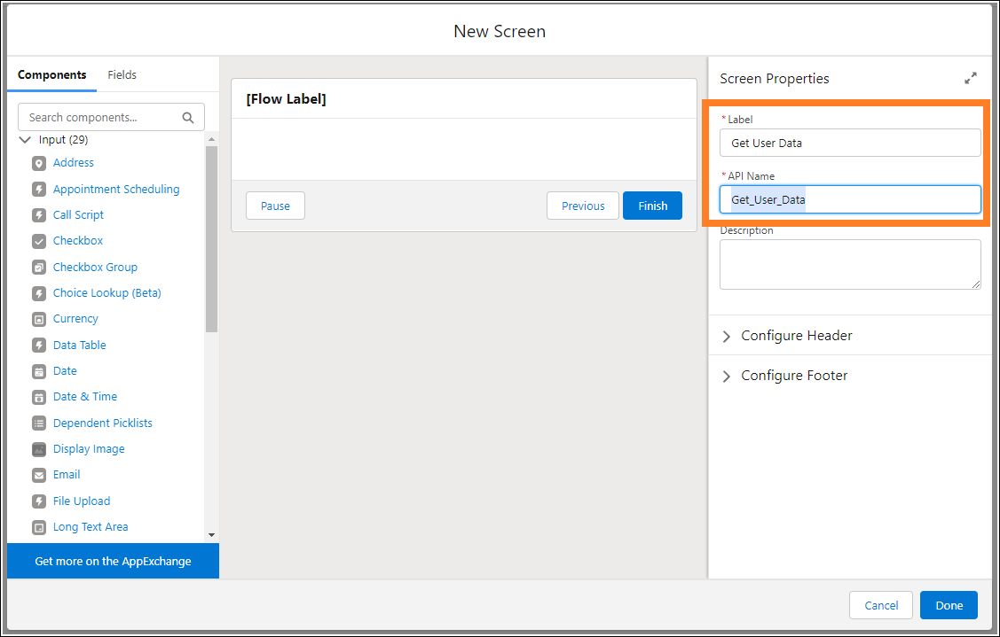

## Dodaj komponent Text
Odnajdź komponent **Text** (1) i kliknij go albo przeciągnij (2), wypełnij pola **Label** i **API Name** (3). Zaznacz **Require** (4) - przy labelce pojawi się czerwona gwiazdka (5).

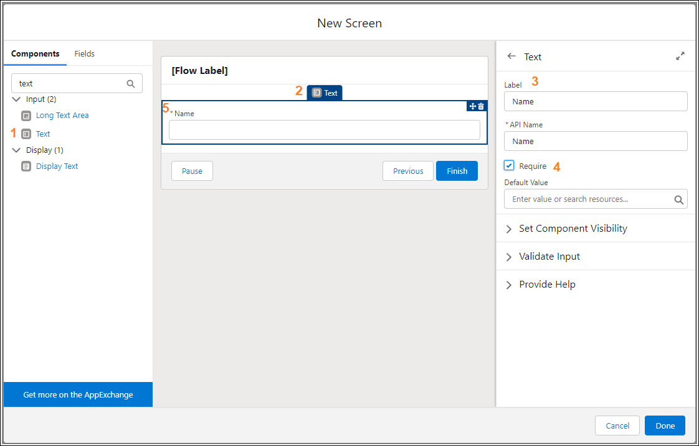

## Dodaj komponent Email

Kliknij lub przeciągnij komponent **Email** (1, 2), wypełnij pole **API Name** (4), w polu **Required** wybierz `{!$GlobalConstant.True}` (5)

Jeśli w polu **Required** usuniesz znaki `.True}`, pojawi się możliwość wybrania *True* albo *False*, nie ma potrzeby każdorazowego wpisywania całej nazwy zmiennej. 
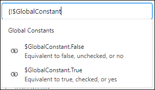

Najedź wskaźnikiem myszki na ikonki 󠁩(i) żeby zapoznać się z różnicą między **Disabled** a **Read Only**.

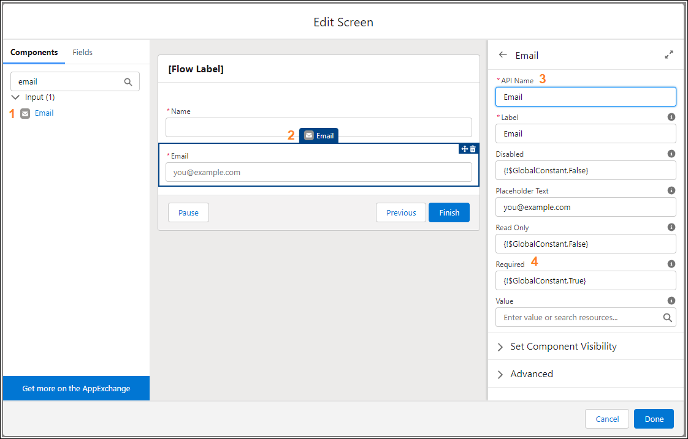

## Dodaj komponent Phone

Kliknij lub przeciągnij komponent **Phone** (1), uzupełnij **API Name** (3) i **Label** (4), w polu **Pattern** (5) podaj wyrażenie regularne `^\d{3}-\d{3}-\d{3}$`, wymuszające na użytkowniku podanie numeru telefonu w odpowiednim formacie, w polu **Placeholder** (6) - ciąg znaków podpowiadający użytkownikowi wymagany format, w polu Required (7) wpisz `{!$GlobalConstant.True}`.

Możesz skorzystać np. ze strony [regexr.com](https://regexr.com/7dv62) żeby dowiedzieć się, co oznacza ciąg znaków `^\d{3}-\d{3}-\d{3}$`

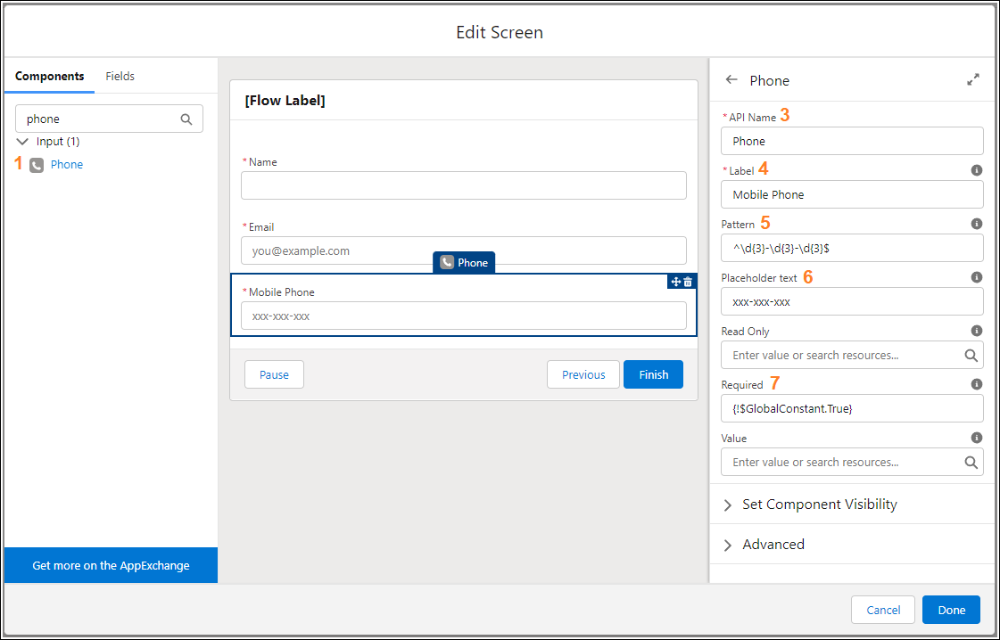

## Dodaj kolejny ekran

To był już ostatni element służący do pobierania danych od użytkownika. Kliknij przycisk **Done**, a następnie wstaw nowy element **Screen** - za już utworzonym. Wypełnij pola **Label** i **API Name** oraz dodaj komponent **Display Text**.

## Uzupełnij tekst z potwierdzeniem danych (1/2)

Rozszerz formularz klikając w ikonkę (1) żeby łatwiej wpisać tekst. Po kliknięciu w **Insert a resource** (2) pojawi się lista elementów, których wartości możemy użyć w naszym potwierdzeniu - zwróć uwagę na (3, 4, 5) - to elementy, które wstawiliśmy na poprzednim ekranie. Żeby dostać się do e-maila i numeru telefonu, trzeba kliknąć w odpowiednią pozycję i wybrać **Value**.

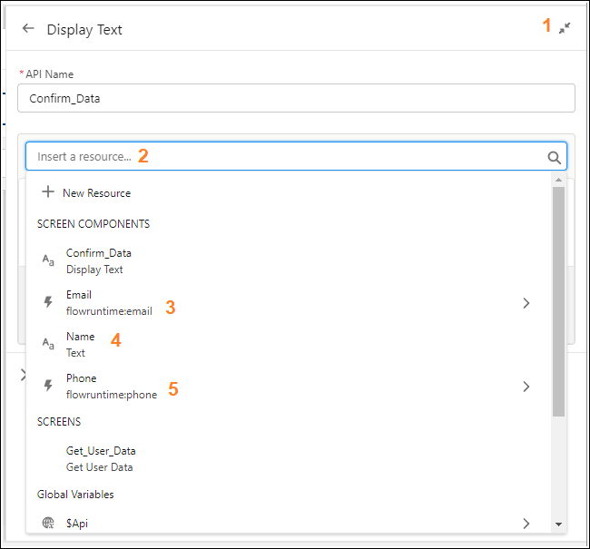

## Uzupełnij tekst z potwierdzeniem danych (2/2)

Kliknięcie **Name**, **Email->Value** oraz **Phone->Value** wstawi element do pola tekstowego. Stwórz tekst proszący użytkownika o potwierdzenie wprowadzonych danych. Możesz łatwo sformatować tekst według wymagań bądź upodobań.

Nie klikaj **Done**, zwęź formularz korzystając z przycisku .

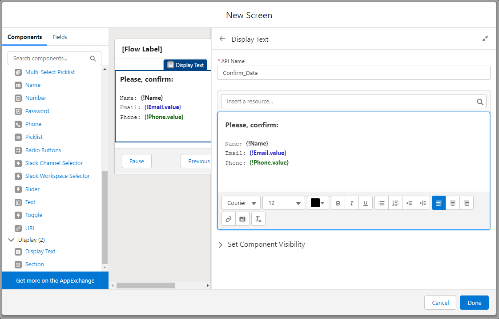

## Nagłówek i stopka

W nagłówku będzie widoczna nazwa naszego Flow. Jeśli nie chcemy go wyświetlać - jest od tego checkbox (2). W **Configure Footer** -> **Previous Button** wybierz **Use a custom label** i wpisz `Go Back`.

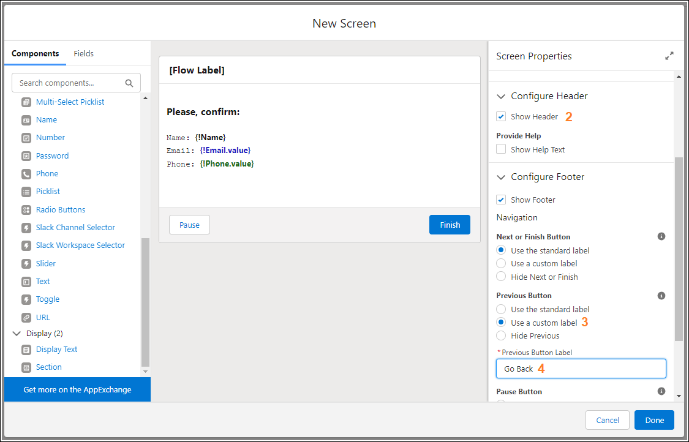

Kliknij **Done**.

## Stworzenie nowego rekordu (1/2)

Dodaj nowy element **Create Records**. Podaj **Label** (1) i **API Name** (2) oraz zaznacz **Use separate resources, and literal values** (3). W polu **Object** (4) wybierz `Contact`.

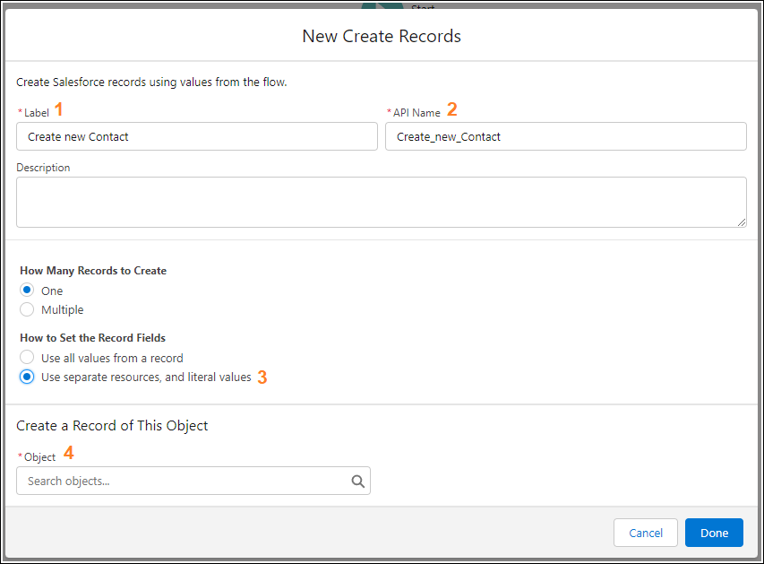

## Stworzenie nowego rekordu (2/2)

W sekcji **Set Field Values for the Contact** podstaw wartości do odpowiednich pól. Wartości wprowadzone przez użytkownika wybierasz w identyczny sposób, jak podczas tworzenia tekstu potwierdzenia. Kliknij **Done**.

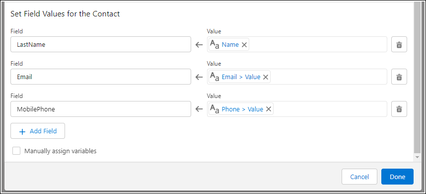

## Test 

Zapisz gotowy flow. Teraz nie musisz go jeszcze aktywować. Kliknij **Run**.

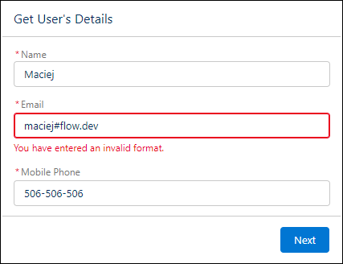

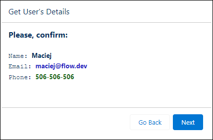

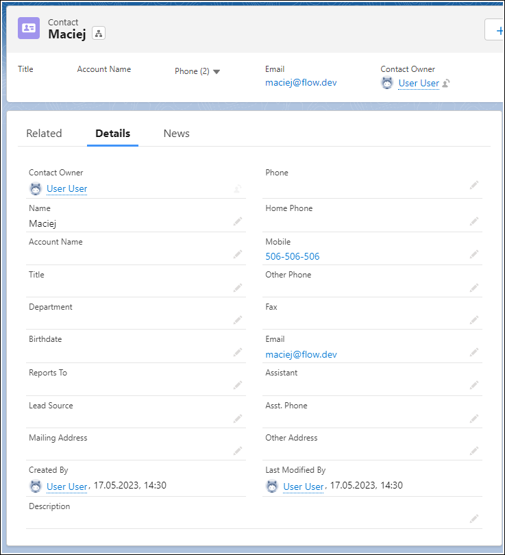